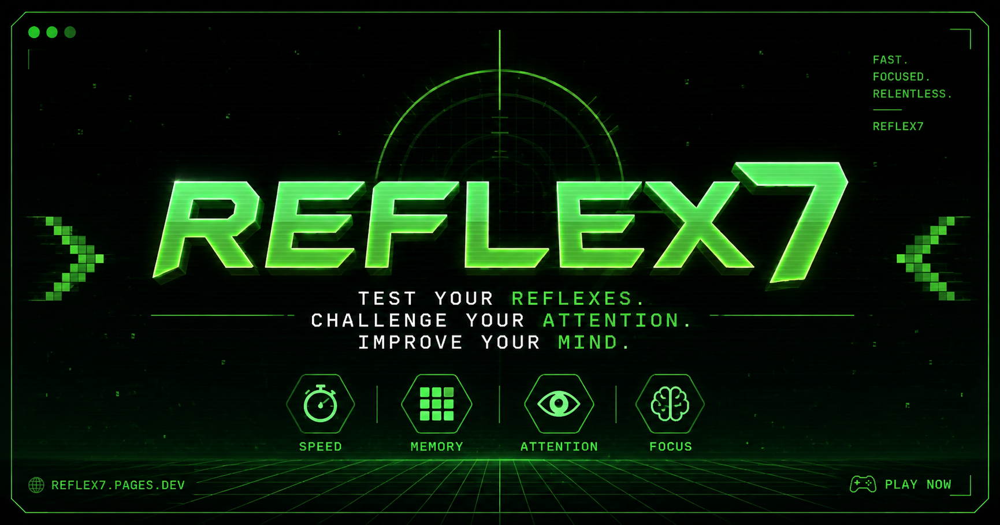

# Reflex7

A fast-paced browser game that tests reflexes, attention, memory, and decision-making through increasingly deceptive challenges.

**Live demo:** [https://reflex7.pages.dev/](https://reflex7.pages.dev/)



## Overview

Reflex7 is a browser-based game built around short reaction, inhibition, timing, visual, arithmetic, memory, sequence, language, deception, and precision tasks. As a session progresses, instructions become less predictable, compatible modifiers appear, and temporary global rules affect multiple rounds.

The game is designed to feel frustrating without becoming arbitrary: valid input is not intentionally ignored, timed mechanics preserve a safe response window, and failures explain what went wrong. The complete interface is available in Turkish and English, and the game works on desktop and mobile browsers.

## Features

- 34 registered task mechanics with weighted selection and repeat protection
- Progressive level-based difficulty in 7-second and 4-second modes
- Deceptive but solvable instructions, visual decoys, and anticipation tasks
- Six difficulty modifiers and five temporary multi-round global rules
- Complete Turkish and English localization with a saved language preference
- Optional retro sound effects generated with the Web Audio API
- Deterministic session score and combo system
- Separate local best levels and scores for each game mode
- Pause, background-tab pause, same-mode retry, and return-to-menu flows
- Mouse, touch, Pointer Events, Enter, and Space input support
- Responsive mobile layout, keyboard focus styles, and reduced-motion support
- Installable PWA with a versioned service worker and offline application shell
- Guarded browser storage so the game remains playable when storage is unavailable

## How to Play

1. Enter an optional nickname and choose the 7-second or 4-second mode.
2. Read each instruction carefully and respond before the timer expires.
3. Use the main control or generated task buttons with a mouse, touch, `Enter`, or `Space`.
4. Expect instructions, modifiers, and global rules to become more deceptive as levels increase.
5. Press `P`, `Escape`, or the pause button to pause the session.

Correct answers increase the combo and session score. A wrong action or timeout ends the run and shows the failure reason and local records.

## Play Now

Play Reflex7 for free at [https://reflex7.pages.dev/](https://reflex7.pages.dev/).

## Tech Stack

- HTML5
- CSS3
- Vanilla JavaScript
- Web Audio API
- Web Storage (`localStorage`)
- Service Worker and Web App Manifest
- Cloudflare Pages

The project has no framework, package manager, backend, database, or build step.

## Run Locally

Clone the configured GitHub repository:

```bash
git clone https://github.com/tunahan-kara/Reflex7.git
cd Reflex7
python -m http.server 8080
```

Then open [http://localhost:8080](http://localhost:8080).

The core game can also be opened directly from `index.html`, but localhost is recommended because service workers require localhost or HTTPS.

## Project Structure

```text
Reflex7/
├── assets/
│   ├── icon.svg              # Browser and PWA icon
│   ├── icon-maskable.svg     # Maskable PWA icon
│   └── og-image.png          # Social sharing preview
├── tests/
│   └── task-engine.test.js   # Dependency-free deterministic test harness
├── index.html                # Application shell, metadata, menus, HUD, and dialogs
├── style.css                 # Game presentation, responsive layout, and motion rules
├── script.js                 # Localization, session state, audio, input, and task engine
├── manifest.webmanifest      # PWA metadata
├── sw.js                     # Offline cache and service-worker lifecycle
├── offline.html              # Offline fallback
├── 404.html                  # Static-hosting not-found page
├── _headers                  # Cloudflare Pages security and cache headers
├── robots.txt                # Search crawler directives
├── sitemap.xml               # Production sitemap
└── bg.png                    # Responsive game background
```

## Testing

Node.js is required only for the validation harness:

```bash
node --check script.js
node --check sw.js
node --check tests/task-engine.test.js
node tests/task-engine.test.js
git diff --check
```

The existing harness validates all 34 task mechanics, translation parity, task selection, timing feasibility, modifiers, global rules, input isolation, pause/resume behavior, retry cleanup, scoring, combo state, local record migration, storage fallback, audio channel behavior, PWA assets, reduced-motion rules, and DOM references.

## Deployment

The repository is connected to Cloudflare Pages. Production deployments are triggered automatically from the `main` branch and publish to [https://reflex7.pages.dev/](https://reflex7.pages.dev/).

No build command or generated output directory is required: Cloudflare Pages serves the repository root as a static site. The `_headers` file defines the production security and cache policy.

## Localization

Turkish is the default language, with complete English support. Menu labels, task instructions, dynamically generated text, rules, modifiers, failure reasons, onboarding, pause controls, and result screens are stored in centralized TR/EN translation dictionaries.

Players can switch languages from the main menu or result screen. The selected language is saved locally when browser storage is available.

## Notes and Limitations

- Scores, best levels, preferences, and mechanic discoveries are stored in the current browser profile only.
- There are no user accounts, online leaderboard, backend services, or server-side score verification.
- Clearing site data removes local records and preferences.
- PWA installation, offline behavior, and icon presentation can vary by browser and device.
- Google Fonts is optional; the game falls back to system monospace fonts when it is unavailable.
